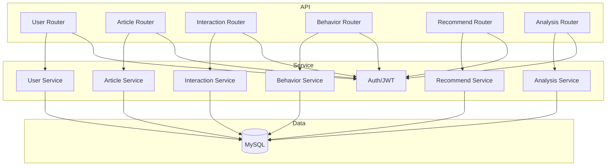
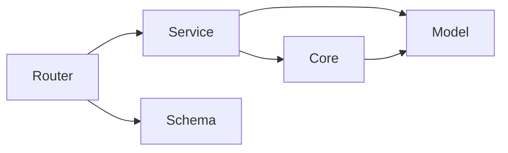
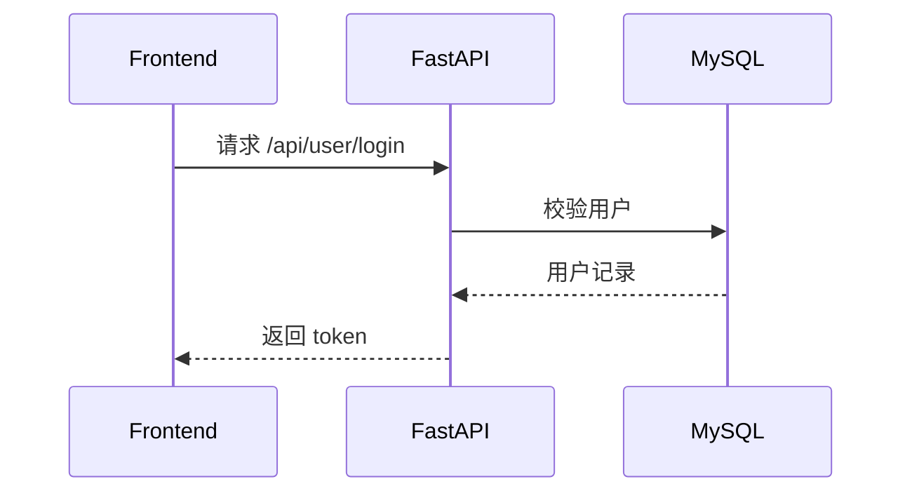

# DESIGN_backend

## 架构概览

## 分层设计
- Router: 处理参数校验、权限依赖、返回格式
- Service: 业务逻辑与数据库事务
- Model: ORM 模型与数据库结构
- Schema: 请求/响应模型
- Core: 配置、JWT、安全工具

## 模块依赖关系

## 接口契约
- 请求/响应遵循 API.md
- 统一返回结构：{ code, message, data }
- JWT 鉴权：Authorization: Bearer <token>

## 数据流向

## 异常处理策略
- 统一异常响应格式
- 业务异常返回 4xxx，系统异常返回 5000
- 日志记录错误与关键业务事件
