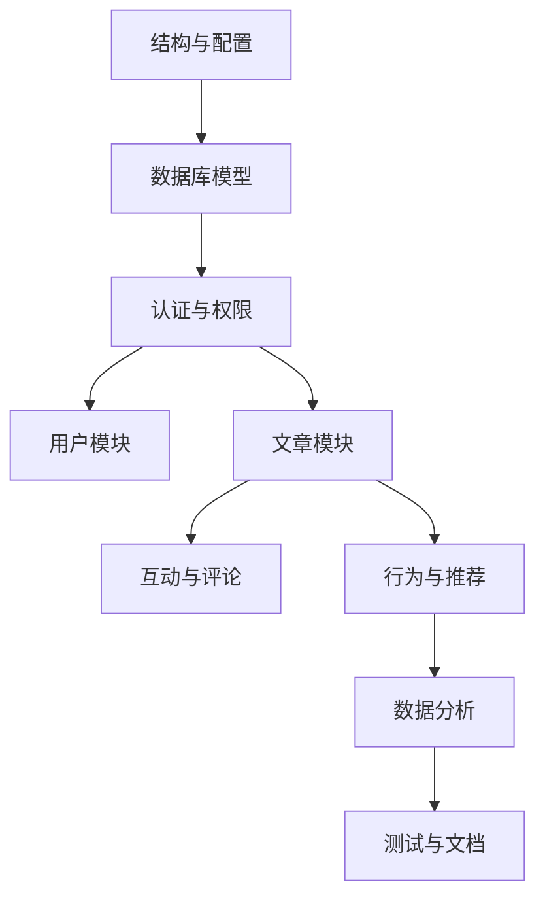

# TASK_backend

## ToDoList (顺序执行)
1. 初始化后端项目结构与基础配置
2. 设计并实现数据库模型
3. 实现认证与权限工具
4. 实现用户模块 API
5. 实现文章模块 API
6. 实现互动与评论模块 API
7. 实现行为上报与推荐模块 API
8. 实现数据分析模块 API
9. 补充测试与文档更新

## 子任务定义

### 1. 初始化后端项目结构与基础配置
- 输入契约：FastAPI + MySQL 技术栈
- 输出契约：可运行的应用骨架、配置文件、依赖清单
- 实现约束：使用环境变量管理敏感信息
- 依赖关系：无

### 2. 设计并实现数据库模型
- 输入契约：API.md 字段与需求文档
- 输出契约：用户、文章、评论、行为、推荐等模型
- 实现约束：role 字段区分用户/管理员
- 依赖关系：1

### 3. 实现认证与权限工具
- 输入契约：JWT 24h 规则
- 输出契约：登录签发/鉴权依赖/角色校验
- 实现约束：无刷新 token
- 依赖关系：1,2

### 4. 实现用户模块 API
- 输入契约：/api/user/* 接口
- 输出契约：注册、登录、用户信息、偏好标签
- 实现约束：仅 email + password
- 依赖关系：2,3

### 5. 实现文章模块 API
- 输入契约：/api/article/* 接口
- 输出契约：发布、编辑、删除、详情、列表
- 实现约束：权限控制与作者校验
- 依赖关系：2,3

### 6. 实现互动与评论模块 API
- 输入契约：点赞/收藏/评论
- 输出契约：互动状态与评论列表
- 实现约束：重复操作可取消
- 依赖关系：2,3,5

### 7. 实现行为上报与推荐模块 API
- 输入契约：/api/behavior/report、/api/recommend/*
- 输出契约：行为记录与推荐列表
- 实现约束：基础推荐逻辑
- 依赖关系：2,3,5

### 8. 实现数据分析模块 API
- 输入契约：/api/analysis/*
- 输出契约：趋势/效果/画像/内容表现
- 实现约束：基础统计
- 依赖关系：2,3,5,7

### 9. 补充测试与文档更新
- 输入契约：已完成接口
- 输出契约：测试用例与文档进度更新
- 实现约束：覆盖关键路径
- 依赖关系：1-8

## 任务依赖图

