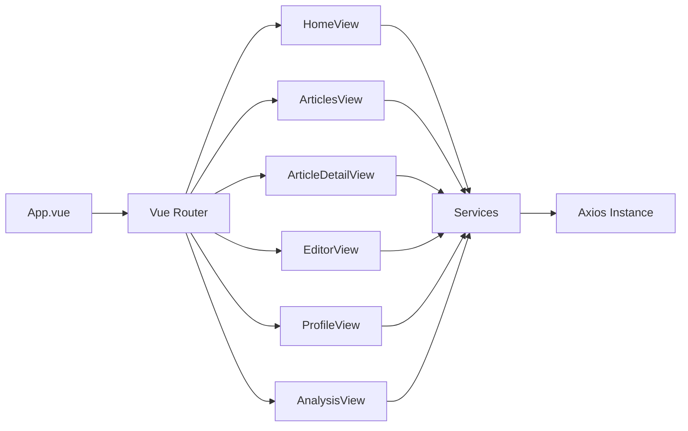

# DESIGN_frontend-core

## 整体架构图

## 分层设计
- 视图层：各页面组件负责 UI/交互/状态
- 服务层：`src/services/*` 统一 API 调用
- 组件层：`AppLayout`、`SectionCard`、`EmptyState` 等复用组件

## 页面功能说明
- 首页：文章列表、搜索/筛选、热门推荐、互动入口（点赞/评论/分享）
- 个人中心：用户信息展示、偏好标签管理、文章管理入口

## 接口契约
- 用户：`/api/user/info`、`/api/user/preference`
- 文章：`/api/article/list`、`/api/article/detail`、`/api/article/publish`、`/api/article/edit`、`/api/article/my-list`
- 上传：`/api/upload/image`
- 互动：`/api/article/like`、`/api/article/collect`、`/api/behavior/comment`、`/api/comment/list`
- 推荐：`/api/recommend/list`、`/api/recommend/similar`
- 行为：`/api/behavior/report`
- 分析：`/api/analysis/read-trend`、`/api/analysis/recommend-effect`、`/api/analysis/user-portrait`、`/api/analysis/content-performance`

## 异常处理策略
- API 拦截统一处理错误码与网络异常
- 页面层提供空状态与错误提示
