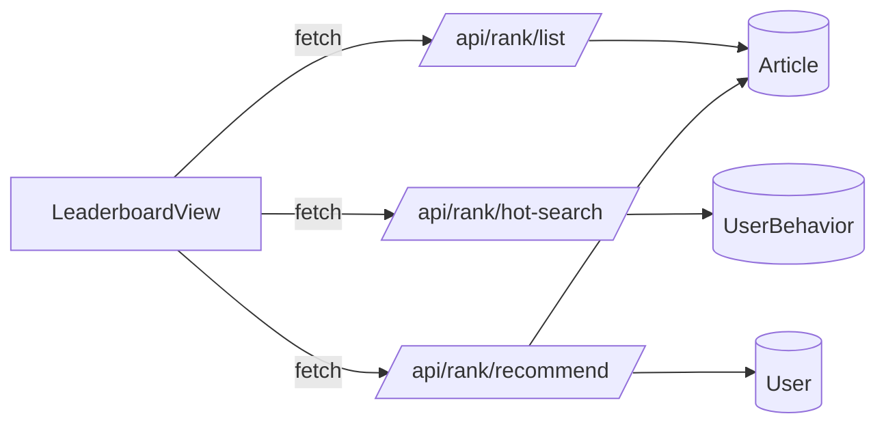

# DESIGN_leaderboard

## 架构概览
- 前端：新增排行榜视图与组件，复用 AppLayout/SectionCard/EmptyState。
- 后端：新增 rank 路由，聚合 Article 与 UserBehavior 数据。

## 模块与组件设计
- 视图：`LeaderboardView.vue`
  - 左侧：`LeaderboardList.vue`（分页、刷新）
  - 右侧：`HotSearchCard.vue`、`RecommendFollowCard.vue`
- 组件：`LeaderboardItem.vue`（排行项展示）

## 数据流设计
1. 进入页面 -> 拉取榜单列表、热搜词、推荐关注
2. 切换分页 -> 重新请求榜单列表
3. 热搜“换一换” -> 递增页码并重新请求热搜

## API 设计
- `GET /api/rank/list`
  - Query: page, page_size, category, keyword
  - 计算：热度 = view + like*3 + collect*5 + comment*4
  - share_count 暂使用 collect_count 字段回填
  - 返回：榜单列表与分页信息
- `GET /api/rank/hot-search`
  - Query: page, page_size
  - 统计：UserBehavior.behavior_type == "search"
- `GET /api/rank/recommend`
  - Query: limit
  - 统计：作者文章数量、总阅读数排序

## 关键函数
- 前端：loadRankList、loadHotSearch、loadRecommend
- 后端：_build_rank_item、_extract_cover_url、_format_user_name

## 异常处理
- 前端：空列表/加载状态统一使用 EmptyState 与骨架
- 后端：无数据时返回空数组与 total=0

## 架构图（Mermaid）

