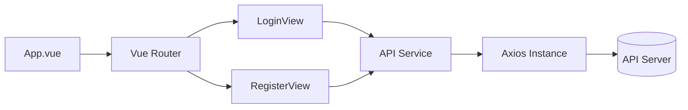
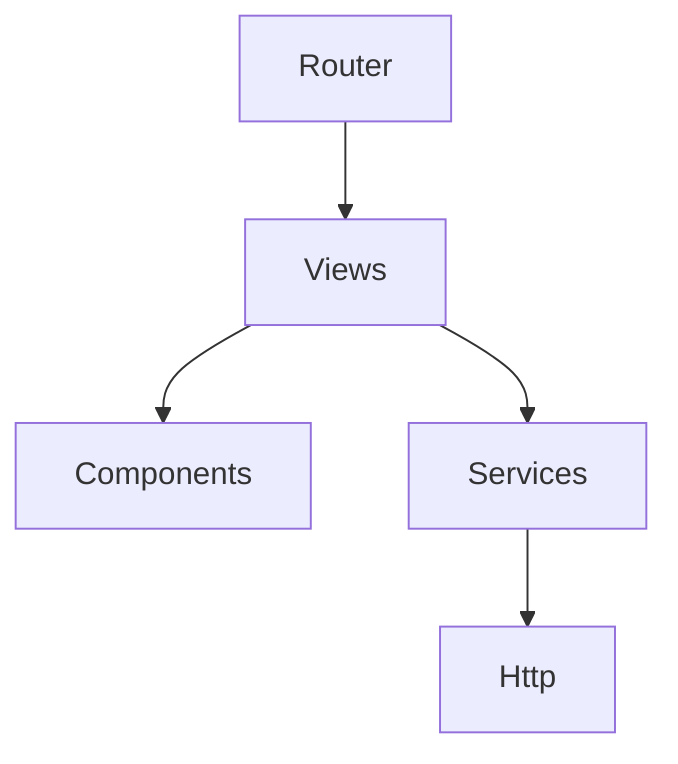
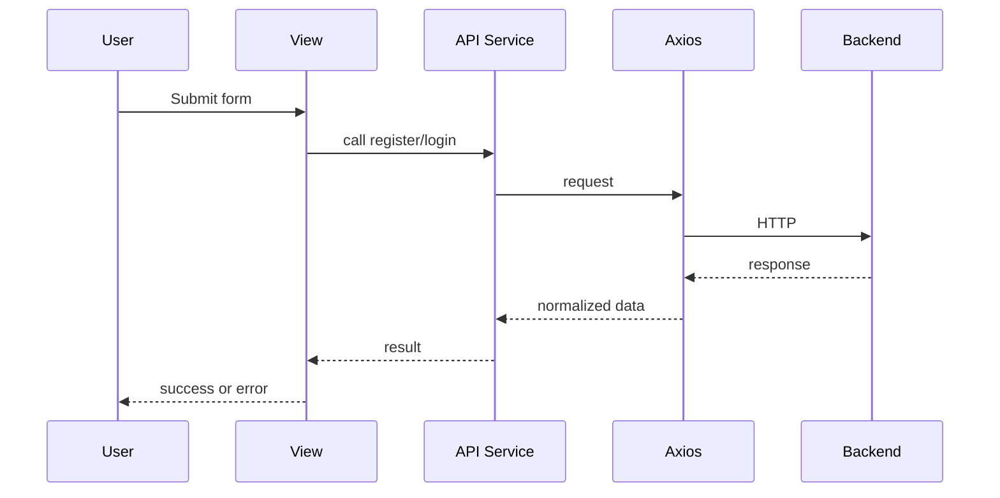

# DESIGN_login-register

## 整体架构图

## 分层设计与核心组件
- UI 层：LoginView、RegisterView、共享布局组件（AuthLayout）。
- 服务层：`src/services/api`（axios 实例、请求封装、错误处理）。
- 路由层：`src/router` 负责路由与重定向。
- 样式层：Tailwind 配置 + 全局样式（Apple 风格）。

## 模块依赖关系图

## 接口契约定义
- `POST /api/user/register`：`{ email, password }`
- `POST /api/user/login`：`{ email, password }`
- 通用响应：`{ code, message, data }`

## 数据流向图

## 异常处理策略
- 请求错误统一在响应拦截器中处理：网络错误、非 0 code。
- 表单校验错误在视图层本地提示。
- API 层返回统一错误对象，视图层显示 toast。
